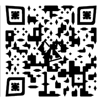

# Video 6
<iframe width="560" height="315" src="https://www.youtube.com/embed/Hf5515C3Bd8" frameborder="0" allow="accelerometer; autoplay; encrypted-media; gyroscope; picture-in-picture" allowfullscreen></iframe>

## Title

---

### He felt pretty good, but he also became complacent.

## Description

---

```
When he asked that, something truly happened everywhere. Perspective adds true tint everywhere right now?
•
We took a trip south to Louisville, and, while I was still a kid, I tried to act a lot bigger than I actually was. You protected me then, so I'll protect you know. At least I'll try.
•
😲😖😮😠 😉😠😖😢
```

### Line-One Code (Section 1)
When one examines line 1 of the description: "When he asked that, something truly happened everywhere. Perspective adds true tint everywhere right now?", they will notice that the first letter of every word spells out `WhatsthePattern`.

---

## Video Content

---

### QR Code
At 0:24, the following QR code appears for a single frame:
<br>

<br>
This leads to a [Fox 59 Article](https://fox59.com/2019/09/19/fentanyl-heroin-thousands-in-cash-seized-from-home-on-indys-south-side/) about a drug bust that occurred in Indianapolis.