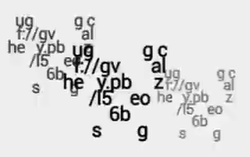

# Video 3
<iframe width="560" height="315" src="https://www.youtube.com/embed/gv9IcACBN6I" frameborder="0" allow="accelerometer; autoplay; encrypted-media; gyroscope; picture-in-picture" allowfullscreen></iframe>

## Title

---

### And, in this place, there lived a baker, who baked better than any other baker.

## Description

---

```
"Sure, Kansas always takes everything on right down" I exclaimed.
•
Sometimes I drive by the old building and think about our time together, and what it really meant. What it really means.
•
uggcf://gvalhey.pbz/ll97ihdq
```

### Line-One Code (Section 1)
When one examines line 1 of the description: "'Sure, Kansas always takes everything on right down' I exclaimed.", they will notice that the first letter of every word spells out `SKateordIe`.

---

### rot13 URL (Section 3)

This section is encrypted using a rot13 caesar cipher:
```
uggcf://gvalhey.pbz/ll97ihdq
```
Once decrypted, this section reads:
```
https://tinyurl.com/yy97vuqd
```
This TinyURL link leads to a [WTHR Article](https://www.wthr.com/article/family-shaken-bullet-hit-newborns-crib) about a family concerned after a stray bullet hits their newborn's crib.

## Video Content

---

### QR Code

At 0:05, the following QR code flashes:
<br>

<br>
This code leads to the same [article](https://www.wthr.com/article/family-shaken-bullet-hit-newborns-crib) mentioned above.
This code flashes again once the video colors invert.

---

### Broken URL
Throughout the video, the following distortion appears:
<br>

<br>
Reading the text left to right yields a rot13-encrypted URL, which once decrypted leads to the following PDF:
<iframe src="../assets/interpersonal_violence_and_illicit_drug_use.pdf" width="100%" height="500px"></iframe><br><br>